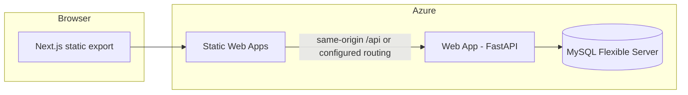

# Technical documentation — Participation Marking App

This document describes the **technology choices**, **how the pieces fit together**, and **what is implemented today**. It is not a setup or installation guide; see `README.md` for local development steps.

---

## Architecture at a glance

The project is a **mono-repo**: the web UI and the HTTP API live in one Git repository and are deployed as **separate Azure resources** (Static Web App and App Service) that are intended to be wired so the browser sees a **single origin** for static assets and `/api/*` calls, which avoids cross-origin (CORS) complexity for typical tutor-facing flows.

---

## Mono-repo layout

| Area | Location in repo | Role |
|------|------------------|------|
| Frontend | Repository root (`app/`, `public/`, Next config) | Tutor UI, built as static files |
| Backend | `api/` | FastAPI application, database access |
| Automation | `.github/workflows/` | Build and deploy pipelines |
| SWA behaviour | `staticwebapp.config.json` | SPA-style routing for the exported app |

Keeping frontend and backend together **version-aligns** API contracts and UI changes, simplifies reviews, and matches how **Azure Static Web Apps** and **GitHub Actions** expect a single connected repository while still allowing **independent deploy workflows** per surface (static site vs. Python app).

---

## Frontend — Next.js (React) on Azure Static Web Apps

### Why this stack

- **Next.js with the App Router** gives a structured way to build pages and client components, with **TypeScript** for safer refactors as participation rules and screens grow.
- **Static export** (`output: 'export'` in `next.config.ts`) produces a folder of HTML/JS/CSS (`out/`), which maps cleanly to **Azure Static Web Apps**: global CDN-style hosting, low operational overhead for a mostly read/write tutor UI, and no need to run a Node server for the default hosting model.
- **Tailwind CSS** (v4) supports fast, consistent styling without a separate design-system build pipeline.
- **React 19** aligns with the current Next.js major line used in the project.

### What we have now

- Next.js **16.x**, React **19.x**, TypeScript, ESLint (`eslint-config-next`).
- **Client-side** API helpers under `app/lib/api.ts` that call **relative** URLs such as `/api/test` and `/api/db-test`, which is the pattern that works when the host (locally: SWA CLI proxy; in Azure: integrated routing) presents API and UI under one origin.
- A starter home page with buttons that exercise the backend and DB test endpoints.
- **Azure SWA workflow** (`.github/workflows/azure-static-web-apps-green-dune-015955600.yml`): builds the app and uploads the **`out`** artifact; `api_location` is left empty because the Python API is **not** hosted as an SWA Functions app—it is deployed separately to App Service (see below).

### Why Azure Static Web Apps (not only “any static host”)

SWA fits a **static-export Next.js** app, integrates **natively with GitHub Actions**, and supports the product story of **linking** the static site to a backend so tutors hit one site URL. That pairing is what makes **same-origin `/api` fetches** practical without ad-hoc CORS configuration on every endpoint.

---

## Backend — Python FastAPI on Azure App Service (Web App)

### Why this stack

- **FastAPI** offers clear route definitions, automatic **OpenAPI/Swagger** docs (`/docs`), and strong typing via **Pydantic**, which helps as request/response models for participation marking evolve.
- **Python 3.12** is the runtime targeted by the deployment workflow, matching a common App Service stack for small teams and straightforward dependency management (`api/requirements.txt`).
- **Uvicorn** (ASGI) is the standard way to serve FastAPI in production-compatible setups on App Service.

### What we have now

- Entry point `api/main.py`: **FastAPI** app with an **`APIRouter` prefix `/api`**, so routes align with frontend paths like `/api/test` and `/api/db-test`.
- **SQLAlchemy** session injection via `get_db` and a minimal **`User`** model mapped to table `test_users` (used for connectivity and read checks).
- Configuration via **`python-dotenv`** and `api/.env` (see `api/.env.example` for variable names); **not** committed to Git.
- **GitHub Actions** workflow `main_partimark.yml`: **manual `workflow_dispatch`**, creates a venv, installs `api/requirements.txt`, uploads the `api` folder as an artifact, logs into Azure with OIDC-style secrets, and deploys to the Web App named **`partimark`** (production slot).

### Why Azure App Service (Web App) for the API

The API is **stateful in the sense of talking to MySQL** and benefits from a **long-running web process**, environment-based secrets, and scaling knobs that fit a **traditional HTTP service** better than SWA’s serverless API model for this codebase. Hosting the API on **App Service** keeps the Python stack isolated from the static front door while still living in the **same repo and Azure subscription**, which is how teams typically **link** SWA to a backend in the portal and keep **one browser origin** for `/api` traffic.

---

## Database — MySQL (Azure Database for MySQL Flexible Server)

### Why this stack

- **MySQL** is a familiar, cost-effective relational choice for structured participation data (sessions, students, marks, etc.).
- **Azure Database for MySQL Flexible Server** provides managed backups, patching, and network integration with Azure compute (App Service), reducing operational load compared to self-managed MySQL.
- **TLS to the database** is required in cloud setups; the project uses **`mysql-connector-python`** with SQLAlchemy and a configurable **`SSL_CA`** path (defaulting to `api/certs/DigiCertGlobalRootG2.crt.pem`), which matches common Azure MySQL certificate chains.

### What we have now

- **SQLAlchemy 2.x** engine built from `DB_USER`, `DB_PASS`, `DB_HOST`, `DB_NAME` (and optional `SSL_CA`).
- A **development convenience** in `api/db.py`: when Uvicorn runs with `--reload`, `DB_NAME` defaults to `partimark-staging` so local hot reload does not accidentally point at the wrong database name unless overridden.
- A **`/api/db-test`** route that runs a simple query (first row of `test_users`) to verify connectivity end-to-end from App Service → MySQL.

---

## Integration, CORS, and `/api` paths

- The frontend **does not hard-code** an API origin; it uses **relative** `/api/...` URLs. Locally, **`npm run swa`** (Azure Static Web Apps CLI) proxies those requests to the FastAPI dev server, so the browser still speaks to **one origin** (e.g. `localhost:4280`).
- In Azure, the same idea is preserved by **connecting Static Web Apps to the backend** (and/or equivalent routing) so `/api/*` is served by the **App Service** API without the browser making cross-origin calls. That is the main reason the **mono-repo + Azure pairing** is attractive: **one product URL**, fewer CORS policies to maintain, and less risk of misconfigured allowed origins in production.

---

## Deployment and GitHub Actions

Both primary workflows are triggered **manually** via **`workflow_dispatch`** (automatic push triggers are commented out). That gives **controlled releases**: you deploy when ready rather than on every commit to `main`.

| Workflow | Purpose |
|----------|---------|
| `azure-static-web-apps-green-dune-015955600.yml` | Build static Next.js output and deploy to **Azure Static Web Apps** |
| `main_partimark.yml` | Package `api/` and deploy to **Azure Web App `partimark`** |

Secrets (SWA deployment token, Azure login for App Service) live in **GitHub repository secrets**; they are referenced by the workflows but not stored in the repo.

---

## Related documents

- **`README.md`** — how to run the frontend, backend, and SWA CLI locally.
- **`api/.env.example`** — environment variable names for database and TLS (values supplied per environment).
