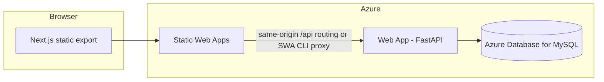

# Technical documentation - Participation Marking App

This document describes the technology choices, how the pieces fit together, and what is implemented today. It is not a setup or installation guide; see `README.md` for local development steps.

---

## Architecture at a glance

The project is a mono-repo: the web UI and the HTTP API live in one Git repository and are deployed as separate Azure resources. The intended product shape is still one browser-facing origin where static assets and `/api/*` calls are routed together, avoiding cross-origin complexity for tutor-facing flows.


```mermaid
flowchart LR
  subgraph browser [Browser]
    UI[Next.js static export]
  end
  subgraph azure [Azure]
    SWA[Static Web Apps]
    APP[Web App - FastAPI]
    DB[(Azure Database for MySQL)]
  end
  UI --> SWA
  SWA -->|"same-origin /api routing or SWA CLI proxy"| APP
  APP --> DB
```

---

## Mono-repo layout

| Area | Location in repo | Role |
|------|------------------|------|
| Frontend | Repository root (`app/`, `public/`, `next.config.ts`) | Tutor and unit-coordinator UI, built as a static Next.js export |
| Backend | `api/partimark_app/` | FastAPI application, versioned API routers, auth, database access, admin UI, integrations |
| Backend migrations | `api/alembic/` | Alembic migrations for the MySQL schema |
| Backend tests | `api/tests/` | CRUD and route tests for core resources |
| Automation | `.github/workflows/` | Manual frontend deploy, backend deploy, and backend CI workflows |
| SWA behaviour | `staticwebapp.config.json` | SPA-style routing for the exported app |

Keeping frontend and backend together version-aligns API contracts and UI changes while still allowing independent deploy workflows per surface.

---

## Environments

We maintain two main environments: production on Azure and localhost for development. Local development still connects to Azure-hosted MySQL rather than requiring a local database server.

| | Production | Localhost |
|---|------------|-----------|
| Purpose | Live app for real use | UI and API development |
| Frontend | Azure Static Web Apps at `https://partimark.app` | Next.js dev server, commonly fronted by SWA CLI at `localhost:4280` |
| Backend | Azure App Service Web App `partimark` | FastAPI via Uvicorn on port 8000 |
| Database | Azure Database for MySQL, selected by App Service environment settings | Azure Database for MySQL using credentials in `api/.env` |
| Runtime configuration | Azure App Service settings and GitHub secrets | `api/.env` loaded by Pydantic settings |

Current required backend environment variables are listed in `api/.env.example`:

```env
DB_USER=
DB_PASS=
DB_HOST=
DB_NAME=
SSL_CA=./certs/DigiCertGlobalRootG2.crt.pem
PASETO_SECRET_KEY=
LOGIC_APP_SECRET=
```

`PASETO_SECRET_KEY` is now required by `api/partimark_app/core/config.py` and is used to derive the symmetric key for PASETO v4.local access tokens. The backend fails during startup if this value is missing or blank.

---

## Frontend - Next.js on Azure Static Web Apps

### Why this stack

- Next.js with the App Router gives a structured page model and TypeScript support as the participation workflows grow.
- Static export (`output: "export"` in `next.config.ts`) produces the `out/` artifact used by Azure Static Web Apps.
- Tailwind CSS v4 supports fast, consistent styling without a separate design-system build pipeline.
- React 19 and Next.js 16 are the current frontend major versions in `package.json`.

### What we have now

- Next.js 16.1.6, React 19.2.3, TypeScript, ESLint, Tailwind CSS v4, and Azure Static Web Apps CLI.
- App routes and screens for:
  - `/login` with credential login plus dev-only role fallback buttons.
  - `/` role-aware landing that renders either the tutor dashboard or coordinator dashboard.
  - `/workshops` and `/workshops/[workshopId]` for workshop management and workshop detail views.
  - `/students` for student/workshop membership management work.
  - `/config` for week and assessment configuration.
  - `/marking`, `/marking/[weekId]`, and `/marking/[weekId]/review` for marking and review flows.
  - `/analytics` for reporting/analytics UI work.
- Shared app state in `app/context/app-context.tsx`, with frontend persistence in `localStorage` for workshops, workshop students, configuration, active workshop, and session marks.
- Axios-based API client in `app/lib/axios-instance.ts`.
  - Uses `NEXT_PUBLIC_API_URL` when set.
  - Defaults to `/api`, matching the SWA proxy/same-origin deployment pattern.
  - Adds `Authorization: Bearer <token>` from `localStorage` when a token exists.
- API service modules under `app/lib/services/` for auth, health checks, and users.

### Current frontend integration status

The UI has moved beyond the original test page and now represents the main tutor/coordinator product flows. Some data flows are still intentionally frontend-local or mock-backed while API integration continues:

- Week lists still use mock data in parts of the marking and dashboard UI.
- Workshop/student/mark/config state is persisted in browser `localStorage` through `AppProvider`.
- The login screen is wired to a backend auth service path, but the frontend/backend auth response contract still needs final alignment before the dev-only login fallback can be removed.

---

## Backend - FastAPI on Azure App Service

### Why this stack

- FastAPI provides typed routes, dependency injection, and OpenAPI/Swagger docs at `/docs`.
- Pydantic and Pydantic Settings keep request/response schemas and runtime configuration explicit.
- SQLAlchemy 2.x provides ORM models and sessions for the MySQL schema.
- Alembic manages database migrations.
- Uvicorn serves the app locally and in App Service-compatible deployments.

### What we have now

- Main backend entry point: `api/partimark_app/main.py`.
- FastAPI app title: `PartiMark Documentation`.
- Base health/test routes under `/api`:
  - `GET /api/`
  - `GET /api/test`
  - `GET /api/db-test`
- Versioned v1 router mounted under `/api` from `api/partimark_app/api_version/v1/api.py`.
- SQLAdmin mounted at `/api/admin` so it can sit behind the same `/api` routing shape as the rest of the backend.
- `PublicAdminUrlMiddleware` rewrites admin request host/scheme for public admin URLs based on `PUBLIC_APP_HOST` and `PUBLIC_APP_SCHEME`.
- Logic App webhook route mounted at `POST /api/webhook/forms`, protected by `X-LogicApp-Secret` and `LOGIC_APP_SECRET`.

### Versioned API routers

The v1 API currently includes routers for:

| Router | Base path | Notes |
|--------|-----------|-------|
| Auth | `/api/auth` | Login endpoint issues PASETO access tokens |
| Users | `/api/users` | User CRUD, protected by current-user dependency |
| Workshops | `/api/workshops` | Workshop CRUD, protected |
| Students | `/api/students` | Student CRUD, withdrawal, move flows |
| Marks | `/api/marks` | Create/read/update/delete marks, batch marking, export endpoints |
| Enabled weeks | `/api/enabled-weeks` | Week enablement configuration |
| System config | `/api/system-config` | Current and editable assessment/system settings |

Most v1 routers require an authenticated user. Mark routes use a stricter dependency that rejects admin users, so administrators cannot access or modify participation marks through those endpoints.

---

## Authentication and authorization

Authentication has progressed from placeholder docs to implemented backend token utilities:

- `api/partimark_app/core/security.py` uses PASETO v4.local tokens through `pyseto`.
- `PASETO_SECRET_KEY` from `api/.env` or App Service settings is SHA-256 hashed into the 32-byte symmetric key required by PASETO v4.local.
- Access tokens carry `sub`, `role`, `iat`, and `exp` claims.
- Token expiry is checked manually during decode.
- Password verification uses bcrypt hashes stored on the `users` table.
- `api/partimark_app/core/deps.py` provides:
  - `get_current_user` for Bearer-token protected routes.
  - `get_non_admin_user` for mark routes that should exclude admins.
- User roles currently defined in the backend are `UC`, `tutor`, and `admin`.

Open auth integration item: the backend login endpoint currently uses `OAuth2PasswordRequestForm` and returns `TokenResponse` with `access_token` and `token_type`; the frontend auth client currently posts JSON credentials and expects a `user` object in the response. That contract should be reconciled before removing the frontend's dev-only login fallback.

---

## Database - Azure Database for MySQL Flexible Server

### Why this stack

- MySQL is a familiar relational store for structured participation data such as users, students, workshops, memberships, enabled weeks, and marks.
- Azure Database for MySQL Flexible Server provides managed backups, patching, and Azure-hosted connectivity.
- TLS is configured through SQLAlchemy `connect_args` and an `SSL_CA` setting.

### What we have now

- SQLAlchemy engine and session factory in `api/partimark_app/db/db.py`.
- Runtime settings in `api/partimark_app/core/config.py`, loaded from `api/.env` locally.
- Alembic migration setup in `api/alembic/` with migration revisions under `api/alembic/versions/`.
- ORM models for:
  - `users`
  - `students`
  - `workshops`
  - `student_workshop_memberships`
  - `participation_marks`
  - `enabled_weeks`
  - `system_config`
  - `audit_logs`
- CRUD modules under `api/partimark_app/crud/` for the main resources.
- CSV import/export service modules under `api/partimark_app/services/csv/`.

Implementation note: `api/.env.example` currently points `SSL_CA` at `./certs/DigiCertGlobalRootG2.crt.pem`, while the checked-in certificate under `api/partimark_app/certs/` is `DigiCertGlobalRootCA.crt.pem`. The certificate path should be reconciled so a freshly copied `.env` works without manual path correction.

---

## Integration, CORS, and `/api` paths

- The frontend API client defaults to relative `/api` requests.
- Locally, `npm run swa` runs `swa start http://localhost:3000 --api-location http://localhost:8000`, so browser requests go through a single local SWA origin.
- In Azure, the intended setup remains Static Web Apps plus App Service backend routing so `/api/*` is served by the FastAPI app without browser-side cross-origin calls.
- `NEXT_PUBLIC_API_URL` can override the frontend API base URL when an environment needs an explicit API origin.

---

## Deployment and GitHub Actions

| Workflow | When it runs | Purpose |
|----------|--------------|---------|
| `azure-static-web-apps-green-dune-015955600.yml` | Manual `workflow_dispatch` | Builds and uploads the static Next.js `out` artifact to Azure Static Web Apps |
| `main_partimark.yml` | Manual `workflow_dispatch` | Builds/packages `api/`, runs Alembic migrations with production secrets, then deploys to Azure Web App `partimark` |
| `ci.yml` | Manual `workflow_dispatch` | Backend CI: install dependencies, check migrations with Alembic, run pytest |

Push and pull-request triggers are currently commented out in the frontend and backend deploy workflows. That means deployment is deliberate/manual at the moment rather than automatic on every merge to `main`.

Backend deploy secrets used by GitHub Actions include database credentials, Azure login values, and `PASETO_SECRET_KEY`. These values are referenced from GitHub repository secrets and are not stored in the repo.

---

## Testing status

Backend tests exist for the current CRUD and route layers:

- `api/tests/crud/test_crud_users.py`
- `api/tests/crud/test_crud_students.py`
- `api/tests/crud/test_crud_workshops.py`
- `api/tests/routes/test_users_endpoints.py`
- `api/tests/routes/test_students_endpoints.py`
- `api/tests/routes/test_workshops_endpoints.py`

The manual `ci.yml` workflow runs Alembic checks and pytest. Frontend automated tests are not currently represented in the repo.

---

## Current implementation gaps

These are the main follow-up items visible from the current codebase:

- Align frontend auth client with backend auth contract:
  - Backend expects OAuth2 form data at `/api/auth/login`.
  - Frontend currently sends JSON credentials.
  - Backend returns token fields only; frontend currently expects token plus user data.
- Replace frontend mock/localStorage-backed workshop, student, week, config, and mark flows with API-backed data once the endpoints are fully connected.
- Reconcile the configured `SSL_CA` default/example path with the certificate file currently committed in `api/partimark_app/certs/`.
- Update stale Swagger description text in `api/partimark_app/main.py` that still labels authentication as "Coming Soon".
- Decide whether frontend and backend deploy workflows should stay manual or restore push/PR triggers.

---

## Related documents

- `README.md` - local setup and run commands for frontend, backend, and SWA CLI.
- `api/.env.example` - backend environment variable names.
- `api/alembic/README` - Alembic migration notes.
